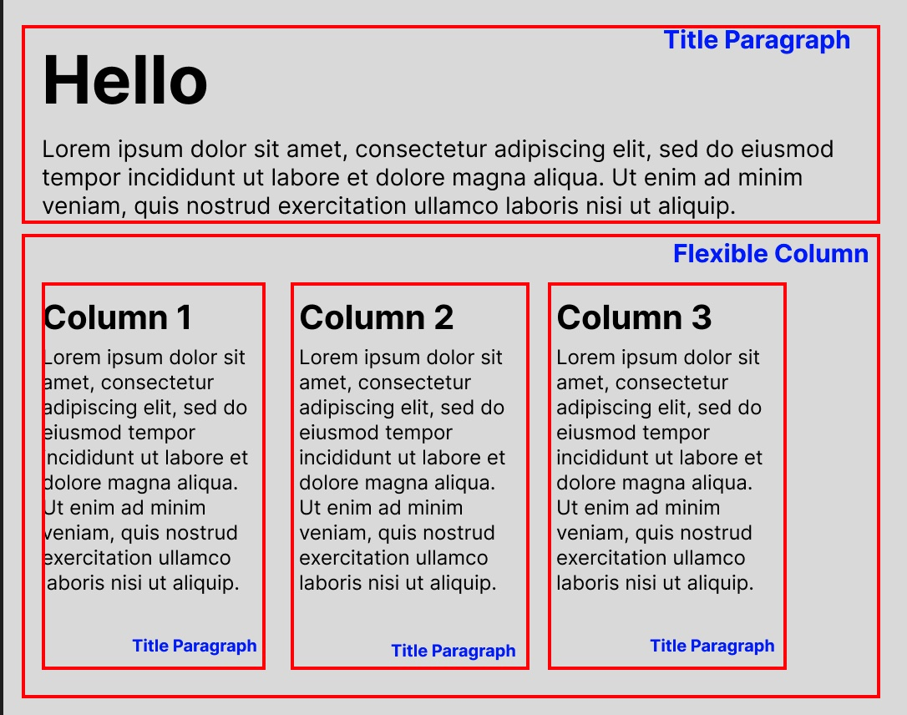

# Architecture Concepts
<a name="concepts"></a>
The concept of Head-On UI is simple: it reads (or requests) metadata from the CMS and take that as an instruction on how to render the component tree.

## Logical building blocks: Elements and Views
The best way to use headless CMS to manage the user experience (UX) or layout, is to create building blocks of widgets that can be assembled into a desired view (or screens). Typically this will align with the UI design principles where UI components are standardized and look consistent throughout the web application.

In Head-On UI, the building blocks are called "Elements". When multiple Elements are assembled together, they become a View. Some Elements can be self-sufficient, some can require nested child Elements.

Elements does not need to always be granular. In some cases, where it makes sense, an Element could be the entire screen when it is not feasible to break up the screen into widgets without breaking the functionality (think of an e-Commerce check-out page.)


## CMS Content Types and Content Objects
Compatible headless CMS's will have a concept of Content Types and Content Objects. Content Type is a template you can create content objects from. To use Object-Oriented Programming terms, Content Type is a class where Content Object is an instance of a class. A content objects can have properties and can reference other content objects (parent-child relationship.) The idea is to build a set of content objects in the CMS to represent the Elements that will be assembled into a View.

## Translating CMS Content Objects to React Components
When Head-On UI retrieve content data from the CMS for a specific View, it traverses through the content data tree and create an equipvalent React component tree with using a *Component Registry*. A Component Registry is a mapping between CMS Content Type to a React Component. It is that simple!

# Example

The best way to further explain the concept is through an example. We assume that you have basic understanding of web content management, and headless CMS.

## Logical design

In this example, you want to create a screen that looks like this:


While there are many ways to logically group the elements, for this example, this is how we will group them.



We are making some assumptions that drives the decision to group them this way:
* The Title-Paragraph Element will be used across many screens in the application.
* The Flexible-Column Element can take any number of columns up to 5.

The React Components that will represent these could look something like this (simplified):

```js
const TitleParagraph = (props) => {
    const { title, paragraph } = props;
    return (
        <div>
            <h1>{title}</h1>
            <p>{paragraph}</p>
        </div>
    )
};

const FlexibleColumn = (props) => {
    /**
     * direction - either "row" or "column", to be used for setting flex-direction of the Flex box 
     * items - a flexible/variable list of Elements to be rendered inside this Flex Box
     */ 

    const { direction, items } = props;

    return (
        <div style={{display: 'flex', flexDirection: direction}}>            
            <RenderView view={{items}} /> 
        </div>
    )
}
```
## Content Management Types and Objects

For this instance, we will demonstrate using Contentful (currently the most simple way headless CMS for integration with Head-On).

> Note that Contentful uses slightly different terminology. "Content type" is called Content Model in Contentful.

Currently, content models need to be created manually in the Content Management Systems. In the future, the framework may provide an automated way of populating the CMS with the essential content types.

### Content Type: View

First Content Model you need to create is called "View", this will represent a View in our logical model. The name of this Content type should be "View" with content type ID (API name) `view`.


Fields:
* `name` is the title of this view, informational purposes only.
* `urlSlug` is the "name" of the view. Typically this would be a path to the view, but it can be anything that is unique across your application.
* `items` and a collection of *references*, essentially this points to all content objects representing Elements in this View


### Content Type: Elements

Then you will need to create content models representing the two Elements we defined: Title-Paragraph, and the Flexible Column.

The following content models are created. Note the "Content Type ID" (or API name) on the right. While these Content Type IDs can be anything, they need to match what we will put in the Component Registry later.

`componentTitleParagraph`


`componentFlexBox`


### Content Objects
Then we will create content objects based on the content types to represent the content we want to display.


## React Code

A simple React application created using [Create React App](https://create-react-app.dev/)

### Head-On configuration module:

```js
// HeadOnConfiguration.ts
import { componentFlexBox } from './component/componentFlexBox';
import { componentTitleParagraph } from './component/componentTitleParagraph';
import { ComponentRegistry, HeadOnProviderPropsOptions, RenderView } from '@headon/react';
import { StaticCmsClient } from '@headon/core';

export const componentRegistry:ComponentRegistry = {
    //.. we will update this later
  };
  
export const contentfulCmsClient = new ContentfulCmsClient({
  contenful: {
    // copy Space ID and Access token from Contentful console
    space: '...', 
    accessToken: '...'
  }
});

```

### Top-level component in the application
Add Head-On Provider
```js
import React from 'react';
import ReactDOM from 'react-dom/client';
import App from './App';
import { HeadOnProvider } from '@headon/react';
import { cmsClient, componentRegistry } from './HeadOnConfiguration';

const root = ReactDOM.createRoot(
  document.getElementById('root') as HTMLElement
);
root.render(
  <React.StrictMode>
    <HeadOnProvider options={{cmsClient}} componentRegistry={componentRegistry}>
      <App />
    </HeadOnProvider>    
  </React.StrictMode>
);
```

### Create Element Components
```js
// component/componentTitleParagraph.tsx
interface componentTitleParagraphProps {
    title: string,
    paragraph: string    
}
export function componentTitleParagraph(props: componentTitleParagraphProps) {
    const {title, paragraph} = props;
    return (
        <div>
            <h1>{title}</h1>
            <p>{paragraph}</p>
        </div>
    )
}
```

```js
// component/componentFlexBox.tsx
import { RenderView } from '@headon/react';
import {HeadOnElement} from '@headon/core';

interface componentFlexBoxProps {
    direction: string,
    items: HeadOnElement[],
}

export function componentFlexBox(props: IcomponentFlexBoxProps) {
    const {direction, items} = props;
    return (
        <div style={{display: 'flex', flexDirection: direction as 'row'|'column'}}>
            <RenderView view={{items}} />
        </dev>
    )
}
```

### Complete the Component Registry
Update the Component Registry in Head-On configuration module.

```js

// HeadOnConfiguration.ts
import { componentFlexBox } from './component/componentFlexBox';
import { componentTitleParagraph } from './component/componentTitleParagraph';

//...

export const componentRegistry:ComponentRegistry = {
    componentFlexBox: {
      componentType: componentFlexBox
    },
    componentTitleParagraph: {
      componentType: componentTitleParagraph
    }
  };

// ...
  
```


The full working code can be found in [the examples](../examples/headon-react/)