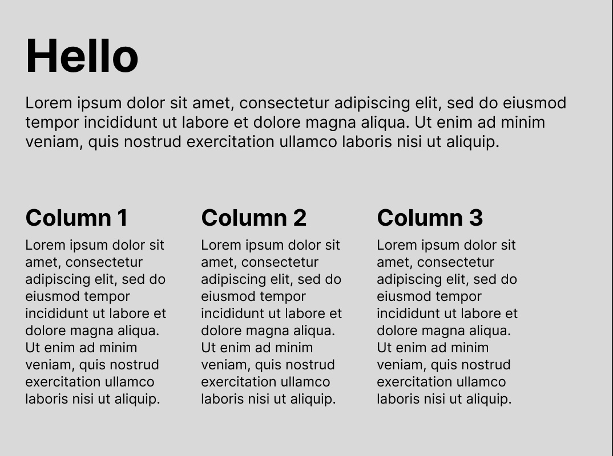
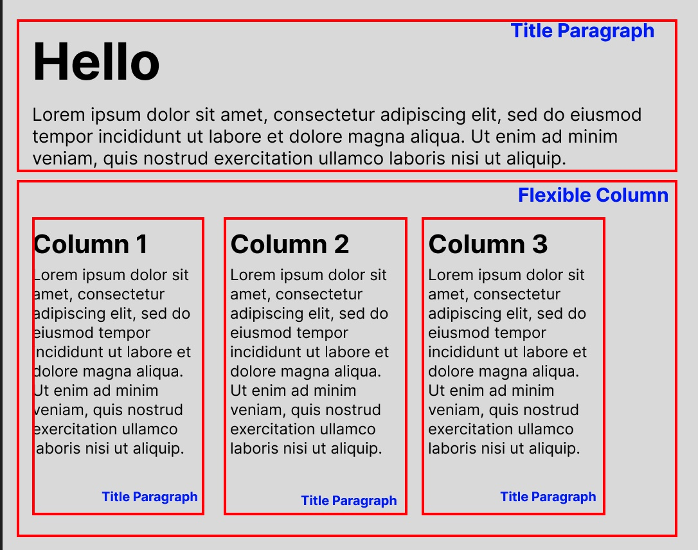
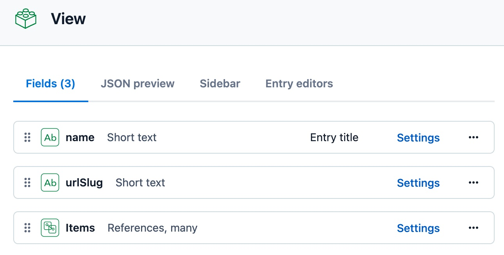

# Table of Contents
* [Get Started](#get-started)
* [Overview](#overview)
* [Architecture Concepts](#concepts)
* [API Reference](#api)
* [Use with Redux](#redux)
* [Integration with Contentful](#contentful)


# Overview
<a name="overview"></a>
The primary objective of Head-On UI is to help web developers create an interactive web application using Open Source frameworks such as React and NextJS, while using "headless" content management system (CMS) for managing the content and the layout of the application. We define headless CMS as a CMS that expose the content via API as JSON (or even XML!), rather than fully-rendered HTML markups. 

Head-On UI does not only inject content (text, labels, etc) into your application, but it also helps you manage the layout as well. The benefit of this is that both the content *and* the layout of your application can be modified on-the-fly without modification to the source code (which leads to rebuild and redeployment.) Non-technical users such as web content manager can manage the content and layout of your React (or NextJS) application as well.

# Architecture Concepts
<a name="concepts"></a>
The concept of Head-On UI is simple: it reads (or requests) metadata from the CMS and take that as an instruction on how to render the component tree.

## Logical building blocks: Elements and Views
The best way to use headless CMS to manage the user experience (UX) or layout, is to create building blocks of widgets that can be assembled into a desired view (or screens). Typically this will align with the UI design principles where UI components are standardized and look consistent throughout the web application.

In Head-On UI, the building blocks are called "Elements". When multiple Elements are assembled together, they become a View. Some Elements can be self-sufficient, some can require nested child Elements.

Elements does not need to always be granular. In some cases, where it makes sense, an Element could be the entire screen when it is not feasible to break up the screen into widgets without breaking the functionality (think of an e-Commerce check-out page.)


## CMS Content Types and Content Objects
Compatible headless CMS's will have a concept of Content Types and Content Objects. Content Type is a template you can create content objects from. To use Object-Oriented Programming terms, Content Type is a class where Content Object is an instance of a class. A content objects can have properties and can reference other content objects (parent-child relationship.) The idea is to build a set of content objects in the CMS to represent the Elements that will be assembled into a View.

## Translating CMS Content Objects to React Components
When Head-On UI retrieve content data from the CMS for a specific View, it traverses through the content data tree and create an equipvalent React component tree with using a *Component Registry*. A Component Registry is a mapping between CMS Content Type to a React Component. It is that simple!

## An Example

The best way to further explain the concept is through an example. We are assuming that you have basic knowledge of web content management, and headless CMS.

In this example, you want to create a screen that looks like this:



While there are many ways to logically group the elements, for this example, this is how we will group them.



We are making some assumptions that drives the decision to group them this way:
* The Title-Paragraph Element will be used across many screens in the application.
* The Flexible-Column Element can take any number of columns up to 5.

The React Components that will represent these could look something like this (simplified):

```js
function TitleParagraph(props) {
    const { title, paragraph } = props;
    return (
        <div>
            <h1>{title}</h1>
            <p>{paragraph}</p>
        </div>
    )
};

function FlexibleColumn(props) {
    const { direction, items } = props;

    return (
        <div style={{display: 'flex', flexDirection: direction}}>
            { /* use Head-On's RenderView component to render child items to ensure content is injected property */}
            <RenderView view={{items}} /> 
        </div>
    )
}
```

For this instance, we will demonstrate using Contentful (currently the most simple way headless CMS for this purpose).

> Note that Contentful uses slightly different terminology. Contentful's Content Model is content type in our definition.

First Content Model is called "View", this will represent a View in our logical model.

Fields:
* `name` is the title of this view, informational purposes only.
* `urlSlug` is the "name" of the view. Typically this would be a path to the view, but it can be anything that is unique across your application.
* `items` and a collection of *references*, essentially this points to all content objects representing Elements in this View

